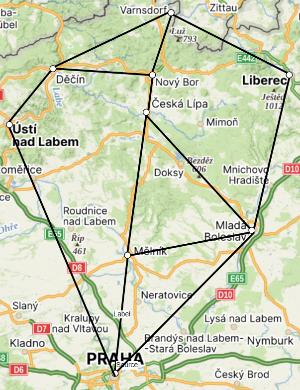

# Mapy
## Zadání úlohy 1: Inicializace matice sousednosti pro neorientovaný ohodnocený graf

### Cíl
Vaším úkolem je vytvořit matici sousednosti pro neorientovaný ohodnocený graf podle přiloženého obrázku. Následně inicializujte proměnnou obsahující tuto matici ve vybraném programovacím jazyce (Node.js, PHP nebo Python).

### Zadání


### Postup
1. **Analýza grafu**
   - Prostudujte přiložený obrázek s neorientovaným ohodnoceným grafem, který představuje síť měst. Ohodnoťte jednotlivé hrany grafu podle vzdálenosti (autem) mezi uzly (městy).
   
2. **Matice sousednosti**
   - Vytvořte matici sousednosti, kde řádky i sloupce odpovídají uzlům grafu.
   - Hodnoty v matici odpovídají ohodnoceným hranám mezi uzly (vzdálenostem mezi městy).
   - Pokud mezi dvěma uzly nevede žádná hrana, zapište do matice `0`.
   
3. **Inicializace matice**
   - Implementujte matici sousednosti v jednom z těchto jazyků: Node.js, PHP nebo Python.
   - Použijte vhodnou datovou strukturu.
   
### Ukázkový příklad řešení matice sousednosti
Pokud máme následující neorientovaný graf se čtyřmi uzly:

```
(A) --5-- (B)
 |         |
 3         2
 |         |
(C) --7-- (D)
```

Matice sousednosti bude:

|   | A | B | C | D |
|---|---|---|---|---|
| A | 0 | 5 | 3 | 0 |
| B | 5 | 0 | 0 | 2 |
| C | 3 | 0 | 0 | 7 |
| D | 0 | 2 | 7 | 0 |

### Výstup
Váš program by měl obsahovat pouze inicializaci matice sousednosti, například:

#### Python:
```python
adj_matrix = [
    [0, 5, 3, 0],
    [5, 0, 0, 2],
    [3, 0, 0, 7],
    [0, 2, 7, 0]
]
```

#### JavaScript (Node.js):
```javascript
const adjMatrix = [
    [0, 5, 3, 0],
    [5, 0, 0, 2],
    [3, 0, 0, 7],
    [0, 2, 7, 0]
];
```

#### PHP:
```php
$adjMatrix = [
    [0, 5, 3, 0],
    [5, 0, 0, 2],
    [3, 0, 0, 7],
    [0, 2, 7, 0]
];
```
## Zadání úlohy 2: Hledání cesty
### Zadání
V dalším úkolu budeme pracovat s maticí sousednosti z úlohy 1 (mapa měst). Ujistěte se, že vaše matice správně odpovídá zadanému grafu. **Nalezněte libovolnou cestu mezi dvěma vybranými uzly a vypočítejte délku této cesty.** Řešení implementujte ve vybraném programovacím jazyce (Node.js, PHP nebo Python).
